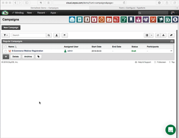

Typeform API for ZeyOS
======================

This is a simple webhook for [Typeform](https://www.typeform.com), which will create an [Opportunity](https://developers.zeyos.com/db/tables/opportunities.html) in [ZeyOS](https://www.zeyos.com).

If you haven't already, install the (ZeyOS SDK)[https://developers.zeyos.com/sdk/] first.

Once installed, you can clone this repository an install the app:

```
$ git clone https://github.com/zeyosinc/typeform.git
$ cd typeform
$ zeysdk link <instance>
$ zeysdk sync
```

Once the service is installed, you can got to ZeyOS and create a new campaign - all your opportunities will be associated with this campaign:



Webhook URL format: `https://cloud.zeyos.com/<instance>/remotecall/typeform.api/<campaign>`

You can read the full blog article, including a short demo video here: https://www.zeyos.com/blog/article/integrating-webforms
